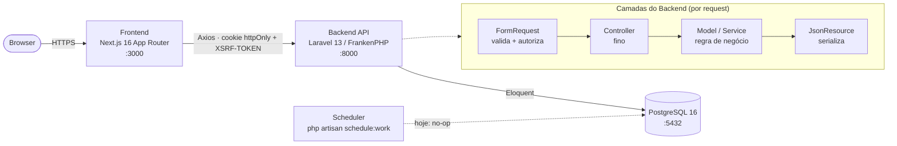
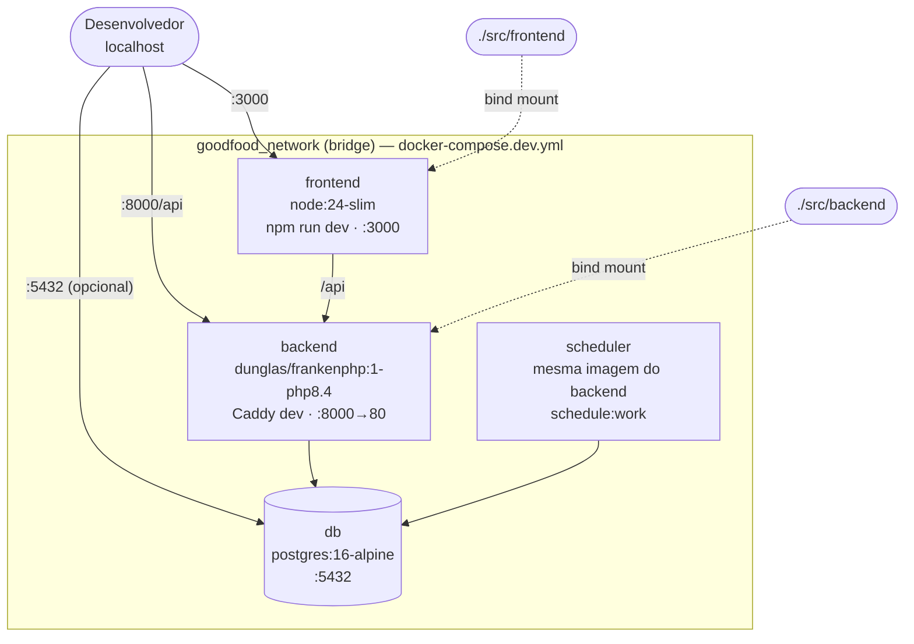
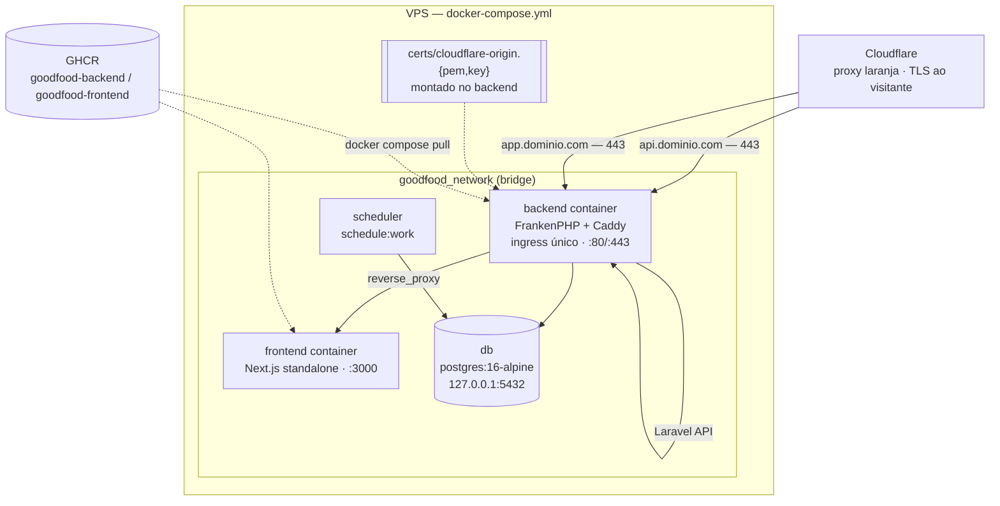
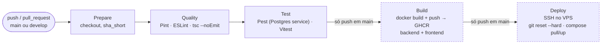

# Arquitetura do Sistema

O GoodFood System separa responsabilidades entre um frontend web (Next.js) e uma API REST (Laravel), com PostgreSQL como banco e todo o ambiente de desenvolvimento conteinerizado via Docker Compose.

```text
Browser ──► Frontend (Next.js :3000) ──► Backend (Laravel/FrankenPHP :8000) ──► PostgreSQL (:5432)
                                                              └── Scheduler (cron diário)
```



---

## 1. Backend — API Laravel

Local: `src/backend`. **Laravel 13** sobre **PHP 8.4** (imagem `dunglas/frankenphp:1-php8.4`), operando exclusivamente como API JSON (`routes/api.php`). Autenticação via **Sanctum SPA stateful** (`statefulApi()` em `bootstrap/app.php`): sessão em cookie httpOnly + proteção CSRF — nenhum token exposto ao JavaScript do navegador.

### Camadas

| Camada | Local | Responsabilidade |
| --- | --- | --- |
| **FormRequests** | `app/Http/Requests/<Feature>/` | Validação de entrada e autorização de requisição (delegando às Policies). Campos sensíveis (`user_id`, `is_template`) são descartados para não-admins no `validated()` |
| **Controllers** | `app/Http/Controllers/` | Finos: recebem o FormRequest validado, orquestram Models/Services e respondem via trait `ApiResponses` |
| **Policies** | `app/Policies/` | Autorização por recurso (dono ou admin; admin tem bypass via `before()`). Auto-descobertas por convenção `Models\X → Policies\XPolicy` |
| **Services** | `app/Services/` | Regras de negócio: `RecipeCostCalculatorService` (precificação de receitas, sempre calculada ao vivo — nunca cacheada) |
| **Resources** | `app/Http/Resources/` | Serialização das respostas (JsonResource por model, com `whenLoaded`/`whenCounted` para relações) |
| **Models** | `app/Models/` | Relacionamentos, casts e accessors. Mass assignment restrito (ex.: `role` de `User` fora do fillable) |
| **Middleware** | `app/Http/Middleware/AdminMiddleware.php` | Gate adicional das rotas administrativas |

### Contrato de resposta e erros centralizados

Toda resposta segue `{ success, message, data, errors? }`:

- Sucessos: trait `ApiResponses` (`respondSuccess`/`respondError`) usado pelo `Controller` base.
- Erros: renderers registrados em `bootstrap/app.php` convertem `ValidationException` (422), `AuthenticationException` (401), `AuthorizationException`/`AccessDeniedHttpException` (403) e `NotFoundHttpException`/`ModelNotFoundException` (404) para o mesmo envelope em rotas `api/*`.

Detalhes de endpoints em [api.md](api.md); entidades e regras em [dominio.md](dominio.md).

### Agendamento

Nenhum comando agendado está registrado em `bootstrap/app.php` no momento — assinaturas não geram pedidos automaticamente (ver [dominio.md](dominio.md#subscription)). O serviço `scheduler` do Docker Compose continua de pé (roda `php artisan schedule:work`), pronto para o dia em que algum job recorrente for necessário; hoje é um no-op inofensivo.

### Evoluções planejadas

- **Repository pattern** apenas se/quando queries complexas justificarem.

---

## 2. Frontend — Next.js

Local: `src/frontend`. **Next.js 16 (App Router)** com **React 19** e **TypeScript strict**.

### Padrões em uso

- **Roteamento internacionalizado**: todo o app vive sob `app/[locale]/` (route groups `(auth)` e `(dashboard)`), com **next-intl** e middleware de locale. O root layout fica em `app/[locale]/layout.tsx`; por isso o 404 global usa `experimental.globalNotFound` + `app/global-not-found.tsx`, e `app/global-error.tsx` cobre erros que escapam do root layout (ambos fora da árvore de locale — texto estático). Ver [internacionalizacao.md](internacionalizacao.md).
- **Estado de servidor**: **TanStack Query** (provider em `components/providers/QueryProvider.tsx`) para fetch, cache e invalidação.
- **Estado de cliente**: **Zustand** apenas para a sessão de autenticação (`hooks/useAuth.ts`). A credencial em si é um cookie httpOnly; `AuthSessionProvider` restaura o usuário via `GET /me` no carregamento.
- **HTTP**: instância única do Axios em `lib/api-client.ts` (`API_BASE_URL`, `withCredentials`, CSRF automático via `ensureCsrfCookie()` antes de mutações). Única exceção de `fetch` direto: API externa ViaCEP, encapsulada em `lib/viacep.ts`.
- **Formulários**: React Hook Form + **Zod** (`@hookform/resolvers`), schemas em `lib/validations/`.
- **Páginas decompostas**: componentes de feature em `features/<feature>/components` (ex.: `features/admin-customers/`).
- **Boundaries**: `error.tsx` e `loading.tsx` por route group, com `unstable_retry` (Next 16).
- **UI**: Tailwind CSS 4 + componentes em `components/ui/` (padrão shadcn sobre Base UI/cmdk), `clsx`/`tailwind-merge` via `lib/utils.ts`, ícones lucide-react, temas com next-themes.
- **Imagens**: `next/image` com `remotePatterns` derivado de `NEXT_PUBLIC_API_URL` (fotos servidas pelo backend em `/storage`).

### Estado atual vs. alvo

- A maioria das páginas é **Client Component** consumindo a API via TanStack Query; com a autenticação agora em cookie httpOnly, a migração gradual de fetch de dados para **Server Components** ficou viável (próximo passo natural).
- Páginas grandes de admin restantes (`admin/catalog`, `production`) ainda aguardam decomposição no padrão `features/`.

---

## 3. Banco de Dados

**PostgreSQL 16** (imagem `postgres:16-alpine`), volume persistente, exposto em `localhost:5432` apenas para desenvolvimento. Schema gerenciado por migrations do Laravel (`src/backend/database/migrations`); dados de exemplo via seeders.

Nos testes, o banco é **SQLite em memória** (`phpunit.xml`) — ver [testes.md](testes.md).

---

## 4. Infraestrutura Docker

Dois ambientes, dois compose files, dois conjuntos de Dockerfiles — **dev nunca builda como prod, prod nunca monta código local**:

```text
docker-compose.dev.yml   # local — builda de docker/dev/, bind mount do código
docker-compose.yml       # VPS  — puxa imagens prontas do GHCR, sem código local
docker/
├── dev/
│   ├── backend/    Dockerfile, php.ini, Caddyfile (FrankenPHP dev)
│   └── frontend/   Dockerfile (node:24-slim, `npm run dev`)
└── prod/
    ├── backend/    Dockerfile multi-stage, entrypoint.sh, php.ini, Caddyfile (prod)
    └── frontend/   Dockerfile multi-stage (Next.js `output: "standalone"`)
```

### Desenvolvimento (`docker-compose.dev.yml`)

| Serviço | Imagem | Porta | Função |
| --- | --- | --- | --- |
| `db` | `postgres:16-alpine` | 5432 | Banco de dados |
| `backend` | `dunglas/frankenphp:1-php8.4` (custom) | 8000 | Servidor web/API (FrankenPHP) com `pdo_pgsql`, `gd`, `bcmath` etc. |
| `scheduler` | mesma do backend | — | Laravel Scheduler (jobs recorrentes) |
| `frontend` | `node:24-slim` | 3000 | `npm run dev` com hot reload |

Código montado por bind mount (`./src/backend` e `./src/frontend`) — editar no host reflete imediato nos containers. Rotas/config do FrankenPHP em `docker/dev/backend/Caddyfile`.



> ⚠️ Processos dos containers rodam como root e podem deixar arquivos com dono `root` no host (`node_modules`, `.next`). Ver a seção de troubleshooting em [configuracao.md](configuracao.md#troubleshooting).

### Produção (`docker-compose.yml`, VPS)

Não builda nada localmente — sobe imagens **já publicadas no GHCR** pelo pipeline de CI/CD (`ghcr.io/<owner>/goodfood-backend` e `-frontend`, tag = SHA curto do commit).

- **`backend`**: imagem multi-stage (`composer install --no-dev`, autoload otimizado). `docker/prod/backend/entrypoint.sh` roda `config:cache`/`route:cache`/`view:cache` e `migrate --force` no start (não no build — dependem de env runtime). Caddy do FrankenPHP é o **ingress único do VPS**: serve a API direto e faz `reverse_proxy` pro serviço `frontend` (dois domínios, um container, ver [implantacao_vps.md](implantacao_vps.md)). TLS via certificado **Cloudflare Origin CA** (Cloudflare em modo Full strict na frente), não Let's Encrypt.
- **`frontend`**: imagem multi-stage Next.js com `output: "standalone"` — runtime final só copia `.next/standalone` + `.next/static`, sem `node_modules` completo.
- **`scheduler`**: mesma imagem do backend, roda só `php artisan schedule:work` (entrypoint pula o `migrate` pra não disputar com o `backend` na subida).



> O container `backend` é o único ingress do VPS: termina TLS com o certificado Origin CA da Cloudflare, serve a API Laravel diretamente e faz `reverse_proxy` para o `frontend` — dois domínios, um único container expondo 80/443. Detalhes de rede/DNS/certificado em [implantacao_vps.md](implantacao_vps.md).

### CI/CD

Pipeline completo em [`.github/workflows/ci-cd.yml`](../.github/workflows/ci-cd.yml): `Prepare → Quality → Test → Build → Deploy`. Build/Deploy só rodam em push na `main` (publica imagens no GHCR + SSH no VPS). Detalhes de gatilhos por branch em [fluxo_git.md](fluxo_git.md#cicd); setup completo do VPS (SSH, GHCR, Cloudflare) em [implantacao_vps.md](implantacao_vps.md).



> Build e Deploy (linhas tracejadas) são condicionais — só executam em push direto na `main`. PRs e pushes na `develop` param em Test.
