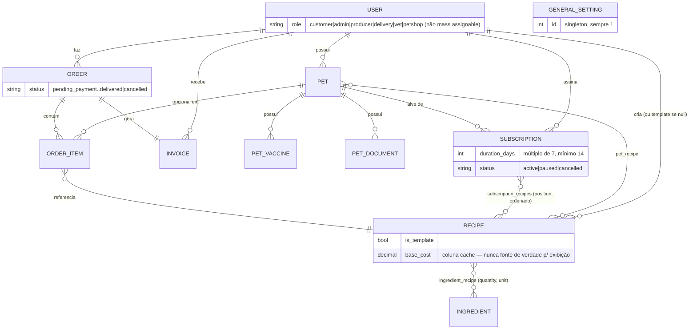

# Modelo de Domínio

O GoodFood System é uma plataforma de alimentação natural para pets por assinatura: tutores cadastram seus pets, recebem receitas personalizadas e fazem pedidos avulsos ou recorrentes. A empresa administra catálogo, produção e entregas.

## Entidades

```text
User (tutor ou admin)
 ├── Pet (1:N)
 │    └── Recipe (N:M via pet_recipe — receitas vinculadas ao pet)
 ├── Recipe (1:N — receitas criadas pelo usuário; templates têm user_id null ou de admin)
 ├── Subscription (1:N — plano semanal fixo, independente de Order)
 │    ├── Pet (N:1)
 │    └── Recipe (N:M via subscription_recipes, ordenada por `position` — uma receita por semana)
 └── Order (1:N)
      ├── OrderItem (1:N — cada item aponta para Recipe e opcionalmente Pet)
      └── Invoice (1:1)

Ingredient
 └── Recipe (N:M via ingredient_recipe, pivot com `quantity` e `unit`)

GeneralSetting (singleton, id=1 — parâmetros globais de precificação)
```

> `Subscription` e `Order` **não têm relação entre si** — não existe `subscription_id` em `orders`. Uma assinatura é um plano salvo, não gera pedidos sozinha (ver [Subscription](#subscription) abaixo).

### Diagrama ER



> `GeneralSetting` não tem chave estrangeira com nenhuma outra entidade — é lido em memória por `RecipeCostCalculatorService` para todo cálculo de custo, mas não referencia nem é referenciado por linhas específicas.

### User
- Campos principais: `name`, `email`, `password`, `phone`, endereço desmembrado (`street`, `number`, `complement`, `neighborhood`, `city`, `state`, `zipcode`), `whatsapp_notifications`.
- **`role`**: `customer` (padrão) | `admin` | `producer` | `delivery`. O campo **não é mass assignable** — é atribuído explicitamente no código (registro público sempre cria `customer`).
- Helpers: `isAdmin()`, `isCustomer()`.

### Pet
- Pertence a um `User`. Campos: `name`, `type` (`dog`|`cat`), `breed`, `weight` (kg), `age` (meses), `birth_date`, `restrictions`, `allergies`, `special_needs`, `photo_url`.
- Foto enviada via `POST /api/pets/upload-photo` (armazenada em `storage/app/public/pets`).

### Ingredient
- Catálogo global (não pertence a usuário). Campos: `name`, `category`, `unit` (kg, g, unit, l), `cost_per_unit`/`unit_cost`, `loss_rate` (fator de perda), `difficulty_multiplier`, `stock_quantity`, `is_active`.
- Somente admins criam/editam/removem; clientes veem apenas os ativos.

### Recipe
- Pode ser **template** (`is_template = true`, criada por admin, visível a todos) ou **receita de cliente** (vinculada a `user_id` e opcionalmente a pets).
- Campos: `name`, `description`, `pet_type` (`dog`|`cat`|`all`), `duration_days`, `daily_portions`, `instructions`, `base_cost`, `ingredient_cost`, `is_active`.
- Ingredientes via pivot com `quantity` e `unit`. `base_cost`/`ingredient_cost` são colunas cacheadas, recalculadas por `updateBaseCost()` a cada `store`/`update` — mas **nunca são a fonte de verdade para exibição**: `RecipeResource` sempre recalcula ao vivo (`calculateCostResult()`) a partir dos ingredientes carregados, então uma mudança no preço de um ingrediente reflete imediatamente em qualquer receita, pedido ou assinatura que a usa, sem precisar resalvar nada.
- Visibilidade para clientes: templates + receitas próprias + receitas vinculadas a seus pets (ver `RecipePolicy`).

### Order / OrderItem / Invoice
- `Order`: `user_id`, `total_price`, `status`, `delivery_address`, `delivery_date`, `scheduled_reposicao_date`. **Sem relação com `Subscription`.**
- Status possíveis: `pending_payment`, `pending`, `in_production`, `ready`, `out_for_delivery`, `delivered`, `cancelled`. Somente admins alteram status.
- `OrderItem`: um por receita selecionada, com `pet_id` opcional (a mesma receita pode aparecer em itens diferentes para pets diferentes) e `unit_price` **sempre calculado ao vivo** (`Recipe::calculateTotalCost()`) no momento da criação do pedido — nunca lido do `base_cost` cacheado.
- `Invoice`: criada junto com o pedido (`amount`, `status` inicial `pending`, `due_date` = hoje + 3 dias).

### Subscription
Plano alimentar semanal de duração fixa para um pet — **não gera pedidos automaticamente** (sem job/scheduler associado; ver [architecture.md](architecture.md#agendamento)).

- `user_id`, `pet_id`, `duration_days` (duração total do plano em dias; mínimo 14, múltiplo de 7), `status` (`active`|`paused`|`cancelled`), `start_date`.
- **Uma receita por semana**: `total_cycles = duration_days / 7` blocos de 7 dias, cada um com exatamente uma receita (pivot `subscription_recipes`, ordenado por `position` = índice da semana). O backend valida que `recipe_ids` tem exatamente esse tanto de itens ao criar/editar.
- **Custo sempre ao vivo e sempre por ciclo de 7 dias**: `estimated_price` (appended) soma `Recipe::calculateTotalCost(7)` de cada receita do plano — 7 dias fixos, **não** a `duration_days` nativa da receita (uma receita cadastrada como "14 dias" no catálogo é cobrada como 1 semana dentro do plano) — e sempre a partir do preço atual dos ingredientes.
- `total_cycles` e `current_cycle_index` (semana atual 0-indexed, ou `null` se o plano não começou/já terminou) também são appended, só para exibição — não disparam nenhum efeito.
- Cancelamento é lógico (status `cancelled`) — histórico preservado, sem hard delete. Editar duração sempre exige reenviar `recipe_ids` junto (tamanho precisa bater com a nova duração).

### GeneralSetting
- Registro singleton (`GeneralSetting::getInstance()`) com os parâmetros globais da fórmula de precificação: custos fixos e multiplicadores de produção, logística, reserva, marketing, fiscal, cobrança, agendamento e dificuldade.

## Regras de negócio principais

### Cálculo de custo de receita (`RecipeCostCalculatorService`)
Calcula o custo estimado de uma receita a partir dos ingredientes selecionados (`quantity` × custo unitário × `loss_rate` × `difficulty_multiplier`), de uma duração em dias e porções diárias, aplicando os parâmetros do `GeneralSetting` (produção, logística, margens etc.). Retorna `estimatedCost`, `ingredientCost`, `costPerKg` e o `costBreakdown` detalhado.

`Recipe::calculateTotalCost(?int $durationOverride = null)` é sempre a via de cálculo real (nunca uma coluna cacheada): sem argumento usa a `duration_days` nativa da receita (pedidos avulsos, catálogo); com `7` força o preço de um único ciclo semanal (usado por `Subscription::estimated_price`). Também exposto via `POST /api/recipes/calculate-cost` para simulação sem persistir — é o que o frontend usa para mostrar o custo de cada semana ao montar uma assinatura.

### Assinaturas não geram pedidos
Diferente de versões anteriores do sistema, `Subscription` **não tem nenhum job/scheduler associado** e nunca cria `Order`. É um plano salvo pelo cliente (pet + duração + uma receita por semana); o cliente pausa, retoma ou cancela manualmente, e usa o plano como referência para fazer pedidos avulsos quando quiser. Não existe `subscription_id` em `orders`.

### Autorização (Policies)
- `PetPolicy`, `OrderPolicy`, `SubscriptionPolicy`: dono ou admin (admin tem bypass via `before()`).
- `RecipePolicy`: visualização inclui templates e receitas ligadas aos pets do usuário; clientes não modificam templates nem transferem propriedade.
- `IngredientPolicy`: mutações somente admin.
- Rotas `/customers` e `/settings` exigem `AdminMiddleware` além do Sanctum.
