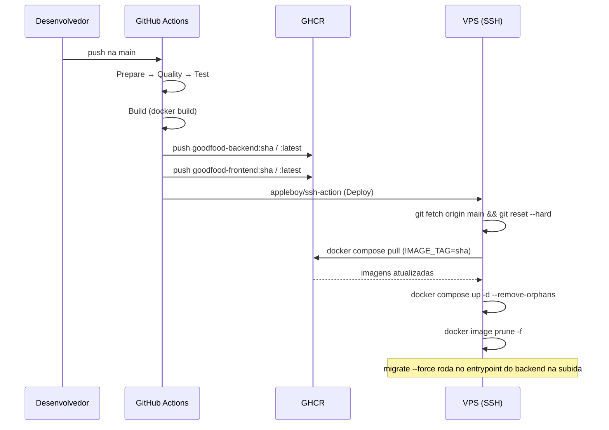
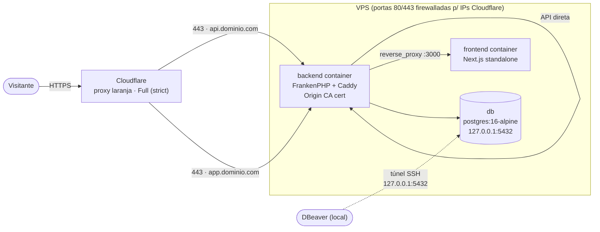

# Deploy no VPS — Docker + CI/CD

Guia passo a passo para preparar um VPS Ubuntu e ligá-lo ao pipeline de
CI/CD em [`.github/workflows/ci-cd.yml`](../.github/workflows/ci-cd.yml).
Para o dia a dia local, veja [setup.md](setup.md); este guia cobre apenas
homologação/produção.

## Visão geral do pipeline

```
push em main
  → Prepare   (checkout, sha)
  → Quality   (Pint, ESLint, tsc)
  → Test      (Pest, Vitest)
  → Build     (docker build + push das imagens para o GHCR)
  → Deploy    (SSH no VPS → git pull configs → docker compose pull/up)
```

As imagens de produção (`docker/prod/backend/Dockerfile` e
`docker/prod/frontend/Dockerfile`) são publicadas em
`ghcr.io/<owner>/goodfood-backend` e `ghcr.io/<owner>/goodfood-frontend`. O
VPS **não builda nada** — só baixa as imagens prontas e sobe o
`docker-compose.yml` da raiz.



### Topologia de rede



> Certificado usado entre Cloudflare e a origem é o **Origin CA** da própria Cloudflare — confiável só nesse trecho, nunca visto pelo navegador do visitante (quem serve HTTPS pro público é sempre a borda Cloudflare). Ver passo 1.4 abaixo.

---

## 1. Preparar o VPS

### 1.1 Acesso e atualização do sistema

```bash
ssh root@SEU_IP
apt update && apt upgrade -y
```

Crie um usuário não-root para operar o deploy (evite usar `root` direto):

```bash
adduser deploy
usermod -aG sudo deploy
```

### 1.2 Instalar Docker Engine + Compose plugin

```bash
curl -fsSL https://get.docker.com | sh
usermod -aG docker deploy
```

Saia e entre novamente como `deploy` para o grupo `docker` valer, depois
confirme:

```bash
docker --version
docker compose version
```

### 1.3 Abrir portas no firewall

```bash
ufw allow OpenSSH
ufw allow 80/tcp
ufw allow 443/tcp
ufw enable
```

Portas 80/443 são obrigatórias: o container `backend` roda Caddy
(FrankenPHP), que termina TLS na origem e faz reverse proxy pro
frontend (ver
[`docker/prod/backend/Caddyfile`](../docker/prod/backend/Caddyfile)).

Opcional (recomendado): já que todo tráfego público passa pela
Cloudflare (proxy laranja, passo 1.4), restrinja 80/443 só aos ranges de
IP da Cloudflare em vez de liberar geral:

```bash
for ip in $(curl -s https://www.cloudflare.com/ips-v4); do ufw allow from $ip to any port 80,443 proto tcp; done
for ip in $(curl -s https://www.cloudflare.com/ips-v6); do ufw allow from $ip to any port 80,443 proto tcp; done
```

### 1.4 Apontar DNS (Cloudflare, proxy laranja) + Origin CA cert

Crie dois registros `A` no painel Cloudflare, **com proxy ativado**
(nuvem laranja) — é a Cloudflare que serve HTTPS pro visitante final:

| Tipo | Host | Valor | Proxy |
| --- | --- | --- | --- |
| A | `api.seudominio.com` | IP do VPS | Proxied (laranja) |
| A | `app.seudominio.com` | IP do VPS | Proxied (laranja) |

Em **SSL/TLS → Overview**, defina o modo como **Full (strict)** — exige
que a origem (o VPS) tenha um certificado válido também, não só a borda
Cloudflare. Para isso:

1. **SSL/TLS → Origin Server → Create Certificate** (deixe os defaults:
   RSA 2048, cobre `*.seudominio.com` + `seudominio.com`, validade 15
   anos).
2. A Cloudflare mostra dois blocos: **Origin Certificate** e **Private
   Key**. No VPS, dentro da pasta do projeto:
   ```bash
   mkdir -p ~/apps/goodfood/certs
   nano ~/apps/goodfood/certs/cloudflare-origin.pem   # cole o Origin Certificate
   nano ~/apps/goodfood/certs/cloudflare-origin.key   # cole a Private Key
   chmod 600 ~/apps/goodfood/certs/cloudflare-origin.key
   ```
   Esses arquivos **não são versionados** (`.gitignore` já cobre
   `/certs/`) — existem só no VPS. O `docker-compose.yml` monta os dois
   em `/etc/caddy/certs/` no container `backend`, e o Caddyfile de
   produção usa esse cert diretamente (ACME público desligado via
   `auto_https disable_certs`, porque atrás do proxy da Cloudflare o
   desafio HTTP-01 do Let's Encrypt não é confiável).

Esse certificado é assinado pela CA da própria Cloudflare — só é
confiável *entre Cloudflare e a origem*; o navegador nunca o vê
diretamente (quem serve HTTPS pro visitante é sempre a borda
Cloudflare).

### 1.5 Gerar Deploy Key do VPS pro GitHub (repo privado)

Repo privado — `git clone`/`git pull` não funciona sem credencial. Gere
uma chave **no próprio VPS**, dedicada só a leitura deste repo (direção
oposta à chave do passo 2 — aquela é GitHub→VPS via SSH pro deploy, esta
é VPS→GitHub via Git pra puxar o código):

```bash
su - deploy
ssh-keygen -t ed25519 -C "vps-goodfood-deploy-key" -f ~/.ssh/goodfood_repo -N ""
cat ~/.ssh/goodfood_repo.pub
```

Copie a saída e cadastre em **Settings → Deploy keys → Add deploy key**
do repositório (não marque "Allow write access" — só leitura é
suficiente). Depois, aponte o Git pra usar essa chave só pra este host:

```bash
cat >> ~/.ssh/config <<'EOF'
Host github.com
  IdentityFile ~/.ssh/goodfood_repo
  IdentitiesOnly yes
EOF
chmod 600 ~/.ssh/config
```

### 1.6 Clonar o repositório

```bash
mkdir -p ~/apps && cd ~/apps
git clone git@github.com:<owner>/<repo>.git goodfood
cd goodfood
```

Este caminho (`/home/deploy/apps/goodfood`) é o `VPS_PROJECT_PATH` usado
pelo secret do GitHub Actions (passo 4).

### 1.7 Criar os arquivos de ambiente (não versionados)

```bash
# Variáveis do docker-compose.yml (raiz do projeto)
cat > .env <<'EOF'
GHCR_OWNER=<owner-em-minusculo>
IMAGE_TAG=latest
DB_DATABASE=goodfood
DB_USERNAME=root
DB_PASSWORD=troque-por-uma-senha-forte
API_DOMAIN=api.seudominio.com
APP_DOMAIN=app.seudominio.com
EOF

# Variáveis do Laravel (lidas via env_file pelos serviços backend/scheduler)
cp src/backend/.env.example src/backend/.env
```

Edite `src/backend/.env` e ajuste no mínimo:

```env
APP_ENV=production
APP_DEBUG=false
APP_URL=https://api.seudominio.com
DB_HOST=db
DB_DATABASE=goodfood
DB_USERNAME=root
DB_PASSWORD=troque-por-uma-senha-forte   # mesmo valor do .env acima

# Obrigatório: sem isso o navegador bloqueia por CORS (frontend e backend
# são domínios diferentes) e o Sanctum não emite cookie de sessão stateful.
SANCTUM_STATEFUL_DOMAINS=app.seudominio.com
CORS_ALLOWED_ORIGINS=https://app.seudominio.com

# Obrigatório também: sem o domínio com ponto na frente, o cookie de
# sessão/CSRF fica host-only só pra api.seudominio.com — o JS do frontend
# em app.seudominio.com não consegue lê-lo via document.cookie pra montar
# o header X-XSRF-TOKEN, e o login falha com "CSRF token mismatch" mesmo
# com CORS correto.
SESSION_DOMAIN=.seudominio.com
```

Gere a `APP_KEY` (uma vez; a imagem ainda não existe localmente, então
rode em qualquer PHP 8.4 disponível ou deixe para depois do primeiro
`docker compose up` e rode via `docker compose exec backend php artisan
key:generate` — nesse caso reinicie o container depois).

Com Cloudflare + Caddy na frente do Laravel, `trustProxies(at: '*')` já
está configurado em `bootstrap/app.php` — seguro porque o firewall do
passo 1.3 só aceita 80/443 vindos dos ranges de IP da Cloudflare, então
`REMOTE_ADDR` é sempre uma borda confiável e `X-Forwarded-*` reflete o
cliente real (`request()->ip()`, `url()->secure()` etc.).

### 1.8 Autenticar o Docker do VPS no GHCR

Necessário porque `docker compose pull` roda localmente no VPS (não só
dentro do job de CI). Repo privado → os pacotes publicados no GHCR
nascem **privados** por padrão, então PAT com só `read:packages` não
basta se o VPS logar com um usuário diferente do dono/publicador; use
uma conta com acesso ao repo (owner ou collaborator) ou libere o pacote
explicitamente em **Package settings → Manage Actions access**. Gere um
**Personal Access Token (classic)** com escopo `read:packages` e faça
login uma vez:

```bash
echo "SEU_TOKEN_PAT" | docker login ghcr.io -u SEU_USUARIO_GITHUB --password-stdin
```

A credencial fica salva em `~/.docker/config.json` do usuário `deploy` e
sobrevive entre deploys.

---

## 2. Gerar e configurar as chaves SSH (GitHub → VPS)

O pipeline usa `appleboy/ssh-action`, que autentica por chave, não senha.

### 2.1 Gerar um par de chaves dedicado ao deploy

**Na sua máquina local** (não no VPS, para manter a privada fora do
servidor):

```bash
ssh-keygen -t ed25519 -C "github-actions-deploy" -f ./goodfood_deploy_key -N ""
```

Isso gera `goodfood_deploy_key` (privada) e `goodfood_deploy_key.pub`
(pública).

### 2.2 Autorizar a chave pública no VPS

```bash
ssh-copy-id -i goodfood_deploy_key.pub deploy@SEU_IP
```

Ou manualmente, dentro do VPS como usuário `deploy`:

```bash
mkdir -p ~/.ssh && chmod 700 ~/.ssh
echo "conteudo-da-chave-publica" >> ~/.ssh/authorized_keys
chmod 600 ~/.ssh/authorized_keys
```

### 2.3 Testar antes de configurar o CI

```bash
ssh -i goodfood_deploy_key deploy@SEU_IP "cd ~/apps/goodfood && docker compose ps"
```

Se conectar sem pedir senha e listar os containers, a chave está correta.
Guarde a **chave privada** (`goodfood_deploy_key`) — ela vai para o secret
`VPS_SSH_KEY` no passo 3. Depois de confirmar, delete a cópia local do
arquivo de chave privada se não for reutilizá-la em outro lugar.

---

## 3. GitHub Secrets necessários

Em **Settings → Secrets and variables → Actions** do repositório:

| Secret | Valor | Uso |
| --- | --- | --- |
| `VPS_HOST` | IP ou hostname do VPS | conexão SSH |
| `VPS_USER` | `deploy` | conexão SSH |
| `VPS_SSH_KEY` | conteúdo da chave **privada** gerada no passo 2.1 | conexão SSH |
| `VPS_PORT` | `22` (ou porta customizada) | conexão SSH |
| `VPS_PROJECT_PATH` | `/home/deploy/apps/goodfood` | diretório do `git pull` + `docker compose` no VPS |

Em **Settings → Secrets and variables → Actions → Variables** (não é
segredo, mas varia por ambiente):

| Variable | Valor | Uso |
| --- | --- | --- |
| `NEXT_PUBLIC_API_URL` | `https://api.seudominio.com/api` | build-arg da imagem do frontend (embutido no bundle) |

O `GITHUB_TOKEN` usado para `docker/login-action` no job **Build** já é
gerado automaticamente pela Actions — não precisa criar secret para isso.

---

## 4. Primeiro deploy

1. Confirme que os passos 1–3 foram concluídos.
2. Dê push na branch `main` (ou rode o workflow manualmente via
   `Actions → CI/CD → Run workflow`, se adicionar `workflow_dispatch`).
3. Acompanhe os jobs `quality` → `test` → `build` → `deploy` em
   **Actions**.
4. No VPS, verifique:
   ```bash
   cd ~/apps/goodfood
   docker compose ps
   docker compose logs -f backend
   ```
5. Acesse `https://app.seudominio.com` e `https://api.seudominio.com/api`
   — o Caddy do container `backend` emite os certificados TLS
   automaticamente no primeiro acesso (pode levar alguns segundos).

## Operação do dia a dia

```bash
# Ver status e logs
docker compose ps
docker compose logs -f backend frontend

# Rollback manual para uma tag específica já publicada no GHCR
IMAGE_TAG=<sha-anterior> docker compose up -d

# Parar tudo (mantém volumes/dados)
docker compose stop
```

Migrations rodam automaticamente na subida do container `backend` (ver
[`docker/prod/backend/entrypoint.sh`](../docker/prod/backend/entrypoint.sh)),
não é necessário rodá-las manualmente após cada deploy.

### Popular o banco (seed)

O entrypoint só roda `migrate --force` — nunca `db:seed` automaticamente,
porque os seeders criam **usuários demo com senha fixa `12345678`**
(`database/seeders/UserSeeder.php`: `admin@goodfood.com`,
`cliente@goodfood.com`, etc.) e dados de exemplo (receitas, pedidos). Rodar
isso sem pensar em produção real seria um risco de segurança.

```bash
docker compose exec backend php artisan db:seed --force
```

Todos os seeders usam `firstOrCreate`/são idempotentes — rodar de novo não
duplica nada. Se for produção de verdade (não demo/portfólio), troque a
senha do admin logo em seguida:

```bash
docker compose exec backend php artisan tinker --execute="
\App\Models\User::where('email', 'admin@goodfood.com')->update([
  'password' => \Illuminate\Support\Facades\Hash::make('SENHA-FORTE-AQUI'),
]);
"
```

### Acesso ao banco via DBeaver (SSH tunnel)

O Postgres do `docker-compose.yml` de produção só expõe
`127.0.0.1:5432` **no próprio VPS** (`ports: - "127.0.0.1:5432:5432"`) —
nunca fica acessível direto pela internet. Para conectar do DBeaver local,
use o túnel SSH nativo dele em vez de expor a porta publicamente:

1. **Database → New Database Connection → PostgreSQL**.
2. Aba **Main**: Host `127.0.0.1`, Port `5432`, Database/Username/Password
   = os mesmos valores do `.env` da raiz no VPS (`DB_DATABASE`,
   `DB_USERNAME`, `DB_PASSWORD`).
3. Aba **SSH**: marque "Use SSH Tunnel" → Host = IP do VPS, User = `deploy`,
   Auth method = *Public Key* apontando pra mesma chave privada usada no
   passo 1.5/2.1 (ou uma nova, só de leitura, se preferir não reusar a de
   deploy).
4. **Test Connection** — o DBeaver abre o túnel SSH até o VPS e, de lá,
   conecta em `127.0.0.1:5432` como se estivesse rodando localmente no
   servidor.

Nunca troque `127.0.0.1:5432:5432` por `5432:5432` no `docker-compose.yml`
— isso expõe o Postgres pra internet inteira, alvo certo de scanners/bots.
